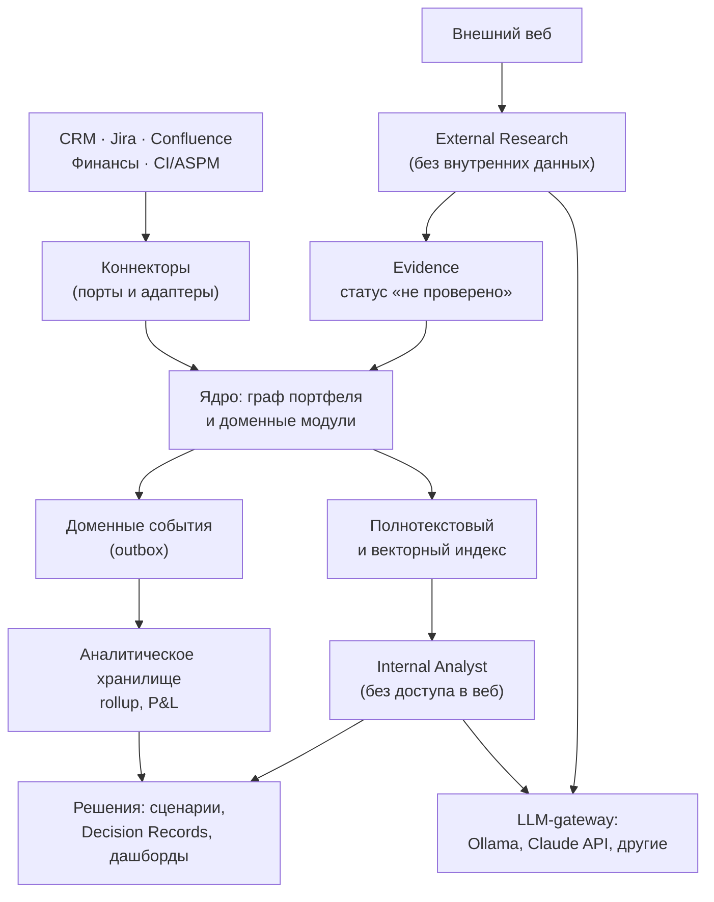
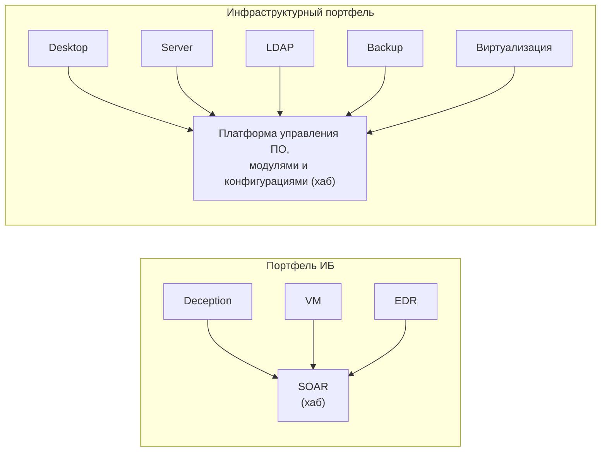
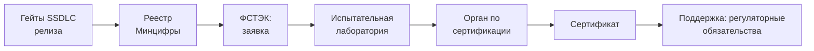

# Платформа управления продуктовым портфелем: концепция, ФТТ, НФТ, ТЗ для агента

2026-09-17 · @Someone

## 1. Концепция

Система — внутренняя платформа портфельного управления продуктами для компании-разработчика ПО. Она связывает CRM, Jira, Confluence, финансовые данные и пайплайн безопасной разработки в одну модель. На этой модели принимаются решения по roadmap, маркетингу и P&L.

Платформа — коммерческий продукт: она поставляется заказчикам для установки в их внутреннем контуре и включается в реестр российского ПО. Требования, которые из этого следуют, собраны в разделе 5.6.

### 1.1. Границы

В границах системы:

- граф портфеля: продукты, хаб-продукт («платформа»), фичи, связи и контракты между продуктами;
- сигналы спроса, discovery, приоритизация, roadmap, обязательства, релизы;
- треки SSDLC и сертификации (реестр Минцифры, ФСТЭК) как часть roadmap и экономики;
- экономика: атрибуция выручки, аллокация затрат, P&L по продукту и портфелю;
- слой решений: сценарии, Decision Records, дашборды;
- LLM-модуль: внутренний аналитик и внешний исследователь.

Вне границ системы:

- клиентские и партнёрские порталы, любой внешний доступ;
- трекинг задач и спринтов (остаётся в Jira);
- хранение и редактирование документов (остаётся в Confluence);
- сканеры, ASPM, CI/CD (платформа только читает их результаты);
- marketing automation и бухгалтерский учёт.

### 1.2. Принципы

1. Источник правды остаётся в операционной системе. Платформа владеет только тем, чего там нет: связями, стратегией, приоритетами, экономикой, решениями.
2. «Платформа» — роль узла графа, а не тип сущности. Хабом может быть SOAR или платформа управления ПО и конфигурациями.
3. Связь между продуктами — контракт с работой на обеих сторонах, а не стрелка.
4. Сертификация — часть roadmap и P&L. Стоимость фичи включает стоимость подтверждения изменений.
5. Внешние системы подключаются через порты и адаптеры. Замена Jira или Confluence не затрагивает домен.
6. LLM готовит материал, решение принимает человек. LLM не меняет приоритеты и не создаёт решения.
7. Два LLM-контура изолированы: внутренние данные и недоверенный веб не встречаются в одном агенте.

### 1.3. Пользователи

| Роль | Что решает | Основной экран |
| --- | --- | --- |
| Руководитель портфеля (CPO) | Инвестиции между продуктами, стратегические ставки | Портфельный дашборд, сценарии |
| PM продукта | Приоритеты, roadmap, discovery своего продукта | Продуктовый дашборд, бэклог |
| PM хаб-продукта | Приоритеты с учётом производного спроса зависимых продуктов | Граф зависимостей, rollup |
| Руководитель разработки | Capacity, прогноз сроков, блокировки | Delivery-дашборд |
| Продуктовый маркетинг | Сегменты, запуски, позиционирование | Win/loss, launch-календарь |
| Финансы | Аллокация затрат, P&L | P&L по продукту и портфелю |
| Руководитель РБПО и сертификации | Гейты SSDLC, треки сертификации, регуляторные сроки | Compliance-дашборд |
| Presale (только чтение) | Что и когда можно обещать клиенту | Sales-safe срез roadmap, матрица совместимости |

### 1.4. Архитектурная схема



Данные идут сверху вниз от источников к решениям. Выход наружу есть только у External Research и у LLM-gateway при включённом внешнем провайдере. External Research не видит внутренних данных.

## 2. Доменная модель

Ядро — типизированный граф портфеля. Каждая сущность принадлежит ровно одному продукту, а связи между продуктами выражены контрактами и типизированными рёбрами.

### 2.1. Сущности

| Сущность | Назначение | Источник правды |
| --- | --- | --- |
| Product | Продукт портфеля; тип продукта задаёт шаблон compliance-трека | Платформа |
| Capability, Feature, Requirement | Иерархия возможностей продукта | Платформа |
| Link | Типизированная связь между продуктами или фичами | Платформа |
| IntegrationContract | Контракт интеграции двух продуктов | Платформа |
| Signal | Запрос или потребность с привязкой к аккаунту, сделке, версии | Платформа (сырьё из CRM, service desk) |
| Account, Deal | Проекция клиентов и сделок, включая регуляторные требования сделки | CRM |
| DeliveryItem | Проекция эпиков, спринтов, версий, worklogs | Jira |
| Document | Метаданные, ссылка и индекс ADR, спеков, отчётов | Confluence |
| RoadmapItem, Release | Плановые элементы и релизы с аудиторными срезами | Платформа |
| CertifiedBaseline | Сертифицированная конфигурация версии продукта | Платформа |
| Commitment | Обязательство: клиентское или регуляторное | Платформа |
| ComplianceTrack, Gate | Трек сертификации версии и его гейты | Платформа |
| RequirementSet | Версионируемый набор требований (ГОСТ, уровни доверия, профили, реестр) | Платформа |
| EvidenceItem | Ссылка, хеш и статус артефакта-доказательства | Платформа (артефакт — во внешней системе) |
| Hypothesis, Interview, Insight | Объекты discovery | Платформа |
| CostEntry, RevenueEntry, AllocationRule | Затраты, выручка, правила аллокации | Финансовая система, CRM |
| DecisionRecord, Scenario | Зафиксированное решение и сценарий «что если» | Платформа |
| Team | Команда разработки; относится на продукты по долям участия | Платформа (доли — из worklogs Jira или вручную) |
| FinancialField, MetricDefinition | Настраиваемые финансовые поля и формулы расчётных показателей | Платформа |
| ImportTemplate, ImportBatch | Шаблон маппинга XLSX на поля и история загрузок по периодам | Платформа |

### 2.2. Типы связей

| Тип | Смысл | На что влияет | Пример |
| --- | --- | --- | --- |
| Интеграционная | Контракт с фичами на обеих сторонах | Roadmap и сроки обоих продуктов | EDR ↔ SOAR |
| Общий компонент | Продукты используют один агент, библиотеку, SDK | SSDLC, уязвимости, SBOM | Общий агент сбора |
| Коммерческая | Бандл, cross-sell | P&L, маркетинг, атрибуция выручки | VM + SOAR в одной сделке |
| Вхождение в поставку | Компонент продукта A входит в дистрибутив продукта B | Сертифицированная конфигурация B | Агент платформы управления в дистрибутиве Server |

### 2.3. Integration Contract

Контракт хранит фичи стороны-поставщика и стороны-потребителя, версию интерфейса, владельца, статус и матрицу совместимости версий. Оба референсных портфеля описываются одной моделью.



Каждая стрелка — контракт. Для EDR → SOAR это Response API на стороне EDR и коннектор с плейбуками на стороне SOAR.

### 2.4. Правила графа

- Циклы между продуктами допустимы. Граф зависимостей фич обязан быть ациклическим; система находит циклы и не даёт сохранить связь, которая его создаёт.
- Производный спрос хаба: `value(F) = own(F) + Σ value(fᵢ) × k(критичность)`. Коэффициенты настраиваются; по умолчанию «блокирует» = 1,0, «ускоряет» = 0,5, «желательно» = 0,2.
- Сдвиг срока фичи распространяется по рёбрам на зависимые фичи и обязательства. Зависимый продукт видит статус того, от чего зависит.
- Влияние на сертификацию распространяется по связям «вхождение в поставку» и «общий компонент».
- У продукта есть приватный контур и стратегический срез (ценность, даты, обязательства, статус compliance). Владелец хаба видит стратегический срез связанных продуктов по ребру графа.

Для контракта правила уточняются так. Ценность контракта равна сумме привязанных к нему сигналов, и каждая фича контракта наследует её с коэффициентом критичности. Срок готовности контракта равен максимуму сроков его фич на обеих сторонах.

### 2.5. Compliance Track

Трек привязан к версии продукта и состоит из гейтов с владельцем, сроком, затратами и чек-листом доказательств. Порядок гейтов задаётся шаблоном по типу продукта: реестр и ФСТЭК формально независимы и частично идут параллельно.



Каждая фича получает класс влияния на сертифицированную конфигурацию: «не затрагивает», «требует анализа влияния», «затрагивает функции безопасности». Класс меняет оценку стоимости и срока фичи. Признак продукта «процессы РБПО сертифицированы» меняет процедуру и длительность подтверждения изменений.

### 2.6. Экономика

P&L продукта считается в двух видах: прямой и с нагрузкой хаба. Затраты хаба аллоцируются на продукты по настраиваемым ключам: доля потребляемых контрактов, выручка, headcount. Затраты сертификации — отдельная статья. Выручка сделок с регуляторным требованием помечается как доступная только при наличии сертификата или записи в реестре.

Исходные данные приходят из Excel, а все расчёты выполняет платформа. Администратор задаёт финансовые поля и формулы показателей; правила аллокации и сценарии считаются тем же движком формул. Каждая финансовая запись несёт две оси детализации — продукт и команду; команда относится на продукты по долям участия. Любое значение раскрывается до формулы и исходных строк импорта.

## 3. Функционально-технические требования

Требования сгруппированы по модулям; идентификатор используется в ТЗ агента и в тестах приёмки. Приоритет: M — обязательно, S — желательно, C — можно отложить. Этап — номер из раздела 6.

### 3.1. Граф портфеля (PG)

| ID | Требование | Приоритет | Этап |
| --- | --- | --- | --- |
| PG-01 | Ведение продуктов с типом, владельцем, жизненным циклом и признаком сертифицированных процессов РБПО | M | 1 |
| PG-02 | Иерархия Capability → Feature → Requirement внутри продукта | M | 1 |
| PG-03 | Типизированные связи четырёх типов (раздел 2.2) между продуктами и фичами, с критичностью | M | 1 |
| PG-04 | Integration Contract: фичи обеих сторон, версия интерфейса, владелец, статус, матрица совместимости версий | M | 1 |
| PG-05 | Обнаружение циклов на уровне фич; отказ в сохранении связи, создающей цикл, с показом пути | M | 1 |
| PG-06 | Расчёт роли хаба по входящей связности; ручное назначение хаба портфеля | M | 1 |
| PG-07 | Rollup производного спроса по формуле раздела 2.4 с настраиваемыми коэффициентами | M | 1 |
| PG-08 | Распространение сдвига сроков по рёбрам с перечнем затронутых фич и обязательств | M | 1 |
| PG-09 | Визуализация графа с фильтрами по типу связи, продукту, статусу | S | 1 |
| PG-10 | Стратегический срез продукта, доступный владельцу хаба по ребру графа | M | 1 |

### 3.2. Сигналы (SG)

| ID | Требование | Приоритет | Этап |
| --- | --- | --- | --- |
| SG-01 | Приём сигналов из CRM, service desk, ручного ввода, импорта файлов | M | 1 |
| SG-02 | Обязательная привязка к продукту; опциональная — к аккаунту, сделке, версии, сегменту | M | 1 |
| SG-03 | Очередь разбора (triage) со статусами и сроком разбора | M | 1 |
| SG-04 | Слияние дубликатов вручную; подсказки похожих сигналов по векторной близости | S | 2 |
| SG-05 | Привязка сигнала к фиче или гипотезе с сохранением денежного веса аккаунта | M | 1 |

### 3.3. Discovery (DS)

| ID | Требование | Приоритет | Этап |
| --- | --- | --- | --- |
| DS-01 | Гипотезы со статусами, допущениями, критерием подтверждения | M | 2 |
| DS-02 | Интервью и инсайты с привязкой к аккаунту, сегменту, гипотезе | M | 2 |
| DS-03 | Evidence с источником, датой, уровнем доверия и статусом проверки | M | 2 |
| DS-04 | Трассировка «сигнал → инсайт → гипотеза → фича → решение» в обе стороны | M | 2 |
| DS-05 | Создание страницы discovery brief в Confluence из шаблона с проставленными связями | S | 2 |

### 3.4. Приоритизация (PR)

| ID | Требование | Приоритет | Этап |
| --- | --- | --- | --- |
| PR-01 | Настраиваемые модели оценки: RICE, WSJF, собственная формула | M | 1 |
| PR-02 | Денежные метрики фичи: ARR запросивших аккаунтов, сумма заблокированных сделок | M | 1 |
| PR-03 | Учёт производного спроса (PG-07) в оценке фич хаба | M | 1 |
| PR-04 | Флаг «регуляторно обязательно» выводит фичу из общего ранжирования | M | 2 |
| PR-05 | Стоимость фичи = разработка + подтверждение изменений по классу влияния (CM-06) | M | 2 |

### 3.5. Roadmap и релизы (RM)

| ID | Требование | Приоритет | Этап |
| --- | --- | --- | --- |
| RM-01 | Представления: timeline, Now/Next/Later, по релизам | M | 1 |
| RM-02 | Аудиторные срезы: внутренний и sales-safe; раскрытие контролируется на уровне API | M | 1 |
| RM-03 | История изменений дат с обязательной причиной | M | 1 |
| RM-04 | Две ветки версии: сертифицированная (только исправления) и развивающаяся | M | 2 |
| RM-05 | Релиз: состав фич, release notes, матрица совместимости из контрактов, даты EOL | M | 2 |
| RM-06 | Уровни запуска (launch tiering) и календарь запусков для маркетинга | S | 3 |

### 3.6. Обязательства (CT)

| ID | Требование | Приоритет | Этап |
| --- | --- | --- | --- |
| CT-01 | Реестр клиентских обязательств: кому, что, срок, основание, владелец | M | 2 |
| CT-02 | Регуляторные обязательства: срок сертификата, срок техподдержки, сроки устранения уязвимостей | M | 2 |
| CT-03 | Алерт при сдвиге roadmap, нарушающем обязательство | M | 2 |
| CT-04 | Автосоздание элемента roadmap за настраиваемый срок до истечения сертификата (по умолчанию 18 месяцев) | M | 2 |

### 3.7. SSDLC и сертификация (CM)

| ID | Требование | Приоритет | Этап |
| --- | --- | --- | --- |
| CM-01 | Каталог версионируемых наборов требований; набор привязывается к типу продукта | M | 2 |
| CM-02 | Шаблоны треков с настраиваемым порядком и параллельностью гейтов | M | 2 |
| CM-03 | Гейт: владелец, срок, затраты, чек-лист доказательств, статус | M | 2 |
| CM-04 | EvidenceItem: ссылка, SHA-256 артефакта, статус; журнал доказательств append-only со сцепкой хешей | M | 2 |
| CM-05 | Релиз получает статус «готов к сертификации» только при закрытых чек-листах гейтов SSDLC | M | 2 |
| CM-06 | Класс влияния фичи на CertifiedBaseline (три значения) с обоснованием и автором | M | 2 |
| CM-07 | Распространение влияния по связям «вхождение в поставку» и «общий компонент»: список затронутых baseline | M | 2 |
| CM-08 | По идентификатору уязвимого компонента — список сертифицированных версий и запуск регуляторных сроков (CT-02) | M | 3 |
| CM-09 | Автосбор доказательств из пайплайна безопасности (SAST, SCA, DAST, фаззинг, SBOM) | S | 3 |

### 3.8. Delivery (DL)

| ID | Требование | Приоритет | Этап |
| --- | --- | --- | --- |
| DL-01 | Маппинг Feature ↔ Epic, Release ↔ Fix Version; создание эпика из платформы | M | 1 |
| DL-02 | Статусы спринтов: цель, состав, прогресс, перенос задач | M | 1 |
| DL-03 | Производные метрики: готовность фичи, scope creep, план/факт | M | 1 |
| DL-04 | Прогноз даты фичи по throughput методом Монте-Карло с доверительным интервалом | S | 3 |
| DL-05 | Worklogs как база распределения затрат по продуктам и фичам | M | 3 |

### 3.9. Экономика (EC)

| ID | Требование | Приоритет | Этап |
| --- | --- | --- | --- |
| EC-01 | Импорт выручки, ФОТ, прямых затрат, маркетинговых бюджетов из XLSX: ручная загрузка и загрузка по расписанию | M | 3 |
| EC-02 | Правила аллокации затрат хаба с версионированием и датой действия | M | 3 |
| EC-03 | P&L продукта в двух видах: прямой и с нагрузкой хаба; P&L портфеля | M | 3 |
| EC-04 | Атрибуция выручки бандлов между продуктами по настраиваемому правилу | M | 3 |
| EC-05 | Инвестиции в фичу против привязанной выручки; стоимость поддержки старых веток | S | 3 |
| EC-06 | Экономика сертификации: затраты трека против выручки, доступной только с сертификатом | M | 3 |
| EC-07 | Шаблоны импорта XLSX: маппинг листов и колонок на поля, предпросмотр, валидация, отчёт об ошибках по строкам. Повторная загрузка периода создаёт новую версию данных; история загрузок хранится | M | 3 |
| EC-08 | Настраиваемые финансовые поля: тип (деньги, число, процент, дата, справочник), измерения (продукт, команда, период, статья), источник (импорт, ручной ввод, расчёт) | M | 3 |
| EC-09 | Формулы расчётных показателей: арифметика, условия, агрегаты по измерениям, ссылки на поля, другие показатели и данные платформы (worklogs, выручка из CRM, численность). Произвольный код в формулах невозможен | M | 3 |
| EC-10 | Граф зависимостей показателей: отказ в сохранении формулы, создающей цикл; пересчёт только затронутых показателей; объяснение значения с раскрытием до формулы и исходных строк импорта | M | 3 |
| EC-11 | Версионирование формул и полей с датой действия и записью в аудит. Закрытый период пересчитывается только явным действием; доступно сравнение результатов двух версий | M | 3 |
| EC-12 | Две оси детализации: продукт и команда. Доли команды по продуктам берутся из worklogs или задаются вручную. Отчёты: P&L по продукту, затраты по команде, матрица «команда × продукт» | M | 3 |
| EC-13 | Сценарии (DA-02) считаются тем же движком формул с подменой входных значений, без изменения фактических данных | S | 3 |

### 3.10. Решения, аналитика, дашборды (DA)

| ID | Требование | Приоритет | Этап |
| --- | --- | --- | --- |
| DA-01 | Decision Record: контекст, снимок данных, варианты, выбор, ожидаемый эффект, дата ревизии | M | 2 |
| DA-02 | Сценарии «что если» под capacity и бюджет с влиянием на обязательства и треки | M | 3 |
| DA-03 | Дашборды: портфельный, продуктовый, хаба, delivery, compliance, P&L | M | 1–3 |
| DA-04 | Маркетинговая аналитика: win/loss по причинам и сегментам, фичи в выигранных сделках, attach rate | M | 3 |
| DA-05 | Конструктор дашбордов через встроенный BI поверх аналитического хранилища | S | 3 |
| DA-06 | Ревизия решения: сравнение ожидаемого эффекта с фактом на дату ревизии | S | 3 |

### 3.11. LLM-модуль (AI)

| ID | Требование | Приоритет | Этап |
| --- | --- | --- | --- |
| AI-01 | LLM-gateway, не зависящий от провайдера: адаптеры Claude API и OpenAI-совместимого API (Ollama, vLLM); журнал всех запросов и ответов | M | 5 |
| AI-02 | Internal Analyst: анализ идеи против сигналов, win/loss, стратегии; карта допущений; поиск противоречий и ранее отвергнутых аналогов | M | 5 |
| AI-03 | External Research: поиск по внешним источникам, research brief со ссылкой на каждый факт | M | 5 |
| AI-04 | Результаты External Research сохраняются только как Evidence со статусом «не проверено» | M | 5 |
| AI-05 | Мониторинг изменений нормативной базы ФСТЭК, Минцифры, БДУ с указанием затронутых наборов требований | S | 5 |
| AI-06 | Контуры изолированы на уровне процессов, сети и учётных данных (раздел 5.3) | M | 5 |
| AI-07 | LLM не имеет прав на изменение приоритетов, roadmap, решений, правил аллокации | M | 5 |
| AI-08 | Единый внутренний интерфейс LLM: диалог, структурированный вывод по JSON-схеме, вызов инструментов, эмбеддинги. Возможности провайдера описаны декларативно; при отсутствии возможности gateway применяет запасной способ или отказывает явно | M | 5 |
| AI-09 | Профили: для каждого контура и задачи администратор задаёт провайдера, модель, лимиты токенов и бюджет. Переключение без перезапуска и без изменения кода | M | 5 |
| AI-10 | Векторный индекс привязан к модели эмбеддингов и версионируется. Смена модели запускает переиндексацию; до её завершения работает прежний индекс | M | 5 |
| AI-11 | Набор эталонных задач для сравнения провайдеров и моделей перед переключением профиля | S | 5 |

### 3.12. Администрирование (AD)

| ID | Требование | Приоритет | Этап |
| --- | --- | --- | --- |
| AD-01 | SSO по OIDC или SAML; локальные учётные записи только для аварийного доступа | M | 1 |
| AD-02 | RBAC по ролям и ABAC по продукту, ребру графа, аудитории roadmap, финансовому уровню | M | 1 |
| AD-03 | Кастомные поля и статусы для Feature, Signal, Hypothesis | S | 2 |
| AD-04 | Журнал аудита: просмотр финансовых данных, экспорт, изменение дат, правил, прав | M | 1 |
| AD-05 | Управление коннекторами: учётные данные, маппинг полей, состояние синхронизации, DLQ | M | 1 |
| AD-06 | Лицензирование поставки: ключ со сроком действия и лимитами, проверка без доступа в интернет | M | 3 |

## 4. Интеграции

Каждая внешняя система подключается через порт ядра и сменный адаптер. Для каждого поля определён один владелец, поэтому двусторонней синхронизации одного и того же поля нет.

### 4.1. Порты и адаптеры

| Порт | Первый адаптер | Читаем | Пишем | Механизм |
| --- | --- | --- | --- | --- |
| DeliveryTracker | Jira Data Center | Эпики, задачи, спринты, доски, версии, worklogs | Создание эпика, приоритет, ссылки на фичу | Webhooks + сверка по JQL по расписанию |
| KnowledgeBase | Confluence Data Center | Метаданные страниц, текст для индекса, labels | Страницы из шаблонов, page properties, labels | REST API + webhooks |
| CRM | Определяется заказчиком | Аккаунты, сделки, стадии, причины win/loss, регуляторные требования сделки | Ничего | API или выгрузка по расписанию |
| Finance | Импорт файлов (CSV, XLSX) | Выручка, ФОТ, затраты, бюджеты | Ничего | Загрузка XLSX вручную и по расписанию; маппинг колонок по шаблону, валидация |
| SecurityPipeline | ASPM или CI заказчика | Результаты SAST, SCA, DAST, фаззинга, SBOM | Ничего | API, этап 3 |
| Identity | IdP заказчика | Пользователи, группы | Ничего | OIDC или SAML, опционально SCIM |
| AuditSink | SIEM заказчика | Ничего | События аудита | Syslog, формат CEF |
| LLMProvider | Ollama (локально) и Claude API; другие провайдеры — через адаптер | Ответы модели | Запросы | HTTP через LLM-gateway |
| WebSearch | Поисковый API по выбору заказчика | Результаты поиска, содержимое страниц | Поисковые запросы после DLP-фильтра | HTTP через egress-прокси, этап 5 |

### 4.2. Общие правила коннекторов

- Входящие события обрабатываются идемпотентно по ключу внешней системы.
- Исходящие записи идут через transactional outbox с повторами и очередью недоставленных (DLQ).
- Сверка по расписанию обязательна для каждого webhook-источника: webhooks теряются.
- Маппинг полей и статусов настраивается в интерфейсе, без изменения кода.
- Учётные данные коннекторов хранятся в хранилище секретов; сервисные учётки имеют минимальные права.
- Состояние синхронизации, отставание и ошибки видны администратору (AD-05).

### 4.3. Confluence: разделение владения

Текст ADR, спеков и отчётов живёт в Confluence. Платформа хранит тип документа, статус, связи с продуктом, фичей и решением, ссылку и индекс. В обратную сторону платформа создаёт страницы из шаблонов (ADR, PRD, discovery brief) и обновляет page properties и labels.

Плагин Confluence для этого не нужен. Он оправдан только ради макросов, показывающих живые данные платформы внутри страницы: статус фичи, фрагмент roadmap, карточку решения. Это этап 4, и решение о нём принимается по подтверждённому спросу; сроки вендорской поддержки Data Center на него не влияют.

### 4.4. Jira: производные данные

Jira владеет статусом поставки. Платформа считает поверх него готовность фичи, scope creep, расхождение плана и факта, прогноз даты. Прогноз строится по историческому throughput команды, а не по оценкам задач.

### 4.5. LLM: независимость от провайдера

Платформа работает с любым провайдером через LLM-gateway: из коробки — Claude API и OpenAI-совместимый API, которым пользуются Ollama и vLLM. Доменный код обращается только к внутреннему интерфейсу gateway и не знает о провайдере.

- Веб-поиск вынесен в отдельный порт WebSearch. Иначе External Research зависел бы от встроенных инструментов конкретного провайдера и не работал бы с локальной моделью.
- Провайдер выбирается отдельно для каждого контура. Типовая схема: Internal Analyst на локальной модели, External Research на внешнем API.
- С локальной моделью платформа работает полностью, поэтому внешний API остаётся опцией и не нарушает NF-L03.
- Промпты хранятся как версионируемые шаблоны без привязки к провайдеру. Различия форматов закрывает адаптер.

## 5. Нефункциональные требования

Система работает только во внутреннем контуре, без входящего доступа из интернета. Расчётный масштаб: до 50 продуктов, 10 000 фич, 1 000 000 сигналов, 500 пользователей, 100 одновременных сессий. Масштаб — допущение, его нужно подтвердить (раздел 8).

### 5.1. Производительность

| ID | Требование | Критерий |
| --- | --- | --- |
| NF-P01 | Чтение по API | P95 ≤ 300 мс |
| NF-P02 | Поиск и фильтрация на расчётном объёме | P95 ≤ 1 с |
| NF-P03 | Распространение сдвига сроков по графу | ≤ 10 с после сохранения |
| NF-P04 | Пересчёт rollup после изменения связи или ценности | ≤ 60 с |
| NF-P05 | Отставание данных Jira | ≤ 5 мин по webhooks; сверка каждый час |
| NF-P06 | Открытие дашборда | P95 ≤ 3 с |
| NF-P07 | Пересчёт P&L | Ночной; по запросу ≤ 10 мин |

### 5.2. Надёжность

| ID | Требование | Критерий |
| --- | --- | --- |
| NF-R01 | Доступность в рабочее время | ≥ 99,5 % в месяц |
| NF-R02 | Потеря данных при аварии | RPO ≤ 15 мин (архивация WAL) |
| NF-R03 | Восстановление после аварии | RTO ≤ 4 ч |
| NF-R04 | Резервное копирование | Ежедневно + PITR; проверка восстановления раз в квартал |
| NF-R05 | Недоступность внешней системы | Платформа работает на последней проекции и показывает признак устаревания данных |
| NF-R06 | Потеря события интеграции | Исключена: outbox, повторы, DLQ, сверка |

### 5.3. Безопасность

| ID | Требование | Критерий |
| --- | --- | --- |
| NF-S01 | Авторизация на уровне API и домена, запрет по умолчанию | Каждая ABAC-политика покрыта автотестом на отказ |
| NF-S02 | Финансовые данные — отдельный уровень доступа | Каждый просмотр и экспорт P&L записан в аудит |
| NF-S03 | Шифрование | TLS 1.2+ для всех соединений; шифрование БД, индексов, резервных копий |
| NF-S04 | Секреты | Только в хранилище секретов; ротация токенов коннекторов; секрет-сканер в CI |
| NF-S05 | Журнал аудита | Append-only, сцепка хешей, выгрузка в SIEM (CEF), хранение 3 года |
| NF-S06 | Журнал доказательств сертификации | Append-only, сцепка хешей, проверка целостности по запросу |
| NF-S07 | Изоляция LLM-контуров | Разные процессы, сетевые сегменты, сервисные учётки; у External Research нет учётных данных БД и индексов |
| NF-S08 | Исходящие запросы External Research | DLP-фильтр по словарю (продукты, аккаунты, суммы); egress только через прокси с журналом |
| NF-S09 | Недоверенный веб-контент | Обрабатывается как данные; единственное право записи агента — черновик Evidence |
| NF-S10 | Внешний LLM-провайдер | Провайдер задаётся отдельно для каждого контура. Перевод Internal Analyst на внешний API — явное действие администратора с записью в аудит; при этом ПДн маскируются, а финансовые данные исключаются из контекста по классам данных |
| NF-S11 | Безопасная разработка самой платформы | SAST, SCA, секрет-сканер, скан образов в CI; SBOM CycloneDX; подпись образов; модель угроз в репозитории |
| NF-S12 | Персональные данные контактов из CRM | Минимизация полей; размещение в РФ; процедура удаления по запросу |
| NF-S13 | Контроль массового экспорта | Порог на объём; событие в SIEM при превышении |
| NF-S14 | Импорт XLSX как недоверенный ввод | Макросы и внешние ссылки не исполняются; формулы ячеек читаются как значения; лимиты на размер и степень сжатия; при экспорте экранируются значения, начинающиеся с =, +, -, @ |
| NF-S15 | Движок формул изолирован | Язык выражений без циклов, ввода-вывода и доступа к окружению; лимит стоимости вычисления; формула видит только поля, доступные её автору |
| NF-S16 | ФОТ по командам не раскрывает индивидуальные зарплаты | ФОТ хранится агрегатом по команде; для команд меньше настраиваемого порога (по умолчанию 5 человек) значение видит только финансовая роль |
| NF-S17 | Интеграция с системами без вендорской поддержки (Jira, Confluence Data Center) | Сервисные учётки с минимальными правами; содержимое из этих систем считается недоверенным: очищается при отображении и помечается как данные при передаче в Internal Analyst |

### 5.4. Эксплуатация и поставка

| ID | Требование | Критерий |
| --- | --- | --- |
| NF-O01 | Развёртывание | Helm-чарт для Kubernetes; docker compose для стенда |
| NF-O02 | Изолированная установка | Работа без доступа в интернет; офлайн-реестр образов |
| NF-O03 | Внешние зависимости | Нет обращений к внешним SaaS в рантайме, кроме явно включённого LLM-провайдера |
| NF-O04 | Наблюдаемость | Трассировки OpenTelemetry, метрики Prometheus, структурные логи JSON |
| NF-O05 | Обновление | Без простоя; миграции БД обратно совместимы на один релиз |
| NF-O06 | Среда | Хосты на отечественных ОС; PostgreSQL или Postgres Pro; браузеры на Chromium, Firefox, Яндекс Браузер |

### 5.5. Сопровождаемость

| ID | Требование | Критерий |
| --- | --- | --- |
| NF-M01 | Границы модулей | Проверяются архитектурными тестами в CI; доступ между модулями только через публичный интерфейс и события |
| NF-M02 | Покрытие тестами | Домен ≥ 80 % строк; правила графа и аллокации — property-based тесты |
| NF-M03 | Адаптеры | Контрактные тесты на записанных ответах внешних систем |
| NF-M04 | API | Версионирование; спецификация OpenAPI — источник, серверные интерфейсы и клиент генерируются из неё |
| NF-M05 | Язык интерфейса | Русский; строки вынесены в ресурсы |

### 5.6. Требования к продукту для реестра и поставки

Платформа будет продаваться и включаться в реестр, поэтому требования к правам на код и лицензиям действуют с первого коммита.

| ID | Требование | Критерий |
| --- | --- | --- |
| NF-L01 | Исключительные права на весь код принадлежат российскому правообладателю | Реестр авторов и оснований возникновения прав ведётся с первого коммита |
| NF-L02 | Лицензии зависимостей | Разрешены MIT, Apache-2.0, BSD, ISC, Zlib; MPL-2.0 — по ADR. GPL, AGPL, SSPL, BSL и лицензии с территориальными ограничениями запрещены. Проверка в CI для Go и npm |
| NF-L03 | Нет обязательных зарубежных проприетарных компонентов | Платформа полностью работает без Jira и Confluence; есть минимум по одному адаптеру под отечественный трекер и wiki |
| NF-L04 | Состав сторонних компонентов | SBOM с лицензиями и происхождением на каждый релиз |
| NF-L05 | Платформа ведёт собственный трек SSDLC | Доказательства по процессам безопасной разработки копятся с первого коммита; с этапа 2 — в самой платформе |
| NF-L06 | Поставка нескольким заказчикам | Нет привязки к одной организации: справочники, шаблоны треков, роли, брендинг — настройки |
| NF-L07 | Документация для реестра и заказчика | Описание функциональных характеристик, руководства по установке и эксплуатации обновляются с каждым релизом |
| NF-L08 | Требования реестра к совместимости | Уточняются по актуальной редакции правил (раздел 8.2) и проверяются на стенде |

Следствие для стека: внешние сервисы тоже выбираются с учётом NF-L02. Например, HashiCorp Vault распространяется под BSL, поэтому хранилище секретов подключается через интерфейс, совместимый с OpenBao.

## 6. Этапы реализации

Пять этапов; модель графа и типы связей закладываются на первом, потому что переделка модели связей позже обходится дороже всего. LLM-модуль идёт последним, но индекс и сущность Evidence появляются на этапе 2.

| Этап | Состав | Критерий готовности |
| --- | --- | --- |
| 1. Ядро и delivery | PG-01…10, SG-01…03, SG-05, PR-01…03, RM-01…03, DL-01…03, AD-01, AD-02, AD-04, AD-05; дашборды продукта, хаба, delivery | Оба референсных портфеля заведены. Сдвиг эпика SOAR в Jira показывает затронутые фичи EDR и их новые даты. Rollup совпадает с контрольным расчётом |
| 2. Discovery, решения, compliance | Адаптер Confluence, DS-01…05, DA-01, CT-01…04, CM-01…07, RM-04, RM-05, PR-04, PR-05, SG-04, AD-03; индекс и Evidence | Трек сертификации версии ведётся от гейтов SSDLC до сертификата. Фича агента платформы управления показывает затронутый baseline продукта Server. ADR создаётся из шаблона со связями |
| 3. Экономика и маркетинг | EC-01…13, DA-02, DA-04…06, DL-04, DL-05, RM-06, CM-08, CM-09; дашборды портфеля, P&L, compliance | P&L продукта в двух видах сходится с контрольным расчётом финансов. Сценарий показывает влияние на обязательства и треки |
| 4. Макросы Confluence | Плагин с макросами статуса фичи, фрагмента roadmap, карточки решения | Выполняется по отдельному решению при подтверждённом спросе |
| 5. LLM-модуль | AI-01…07; сначала Internal Analyst, затем External Research | Тест изоляции: инъекция на веб-странице не приводит к чтению внутренних данных и к записи, кроме черновика Evidence. Каждый факт research brief имеет ссылку |

Поскольку платформа продаётся и включается в реестр, адаптеры под отечественный трекер и wiki (NF-L03) обязательны до первой поставки. Они делаются на этапе 2 сразу после адаптера Confluence. Лицензирование поставки (AD-06) входит в этап 3.

## 7. ТЗ для агента-разработчика

Агент реализует этап 1 по разделам 2–5 этого документа; раздел 7 — его рабочая инструкция и кладётся в корень репозитория как `AGENTS.md`. Этапы 2–5 ставятся отдельными постановками по той же форме. Для этапа 5 модель угроз пишется до кода.

### 7.1. Стек

| Слой | Выбор | Примечание |
| --- | --- | --- |
| Бэкенд | Go (текущая стабильная версия), net/http, chi, pgx v5, sqlc, oapi-codegen, log/slog, OpenTelemetry | SQL проверяется по схеме при генерации sqlc; API — spec-first |
| Граф | gonum/graph в памяти, рёбра в PostgreSQL | Поиск циклов и распространение сроков |
| БД | PostgreSQL 16, схема на модуль, pgvector, миграции goose | FTS и векторы в PostgreSQL на этапах 1–2 |
| Очереди | Outbox и собственный воркер на PostgreSQL (`SKIP LOCKED`) | Брокер добавляется только при невыполнении NF-P03…P05 |
| Аналитика | Материализованные представления на этапе 1; ClickHouse с этапа 3 |  |
| Поиск | PostgreSQL FTS; OpenSearch только при невыполнении NF-P02 |  |
| Фронтенд | TypeScript, React, Vite, TanStack Query, клиент из OpenAPI, React Flow для графа |  |
| BI | Apache Superset, встраивание | Этап 3 |
| Идентификация | OIDC (go-oidc); Keycloak на стенде |  |
| Поставка | Статические бинарники (`CGO_ENABLED=0`), Docker, Helm, docker compose для стенда |  |
| Экономика (этап 3) | excelize для XLSX; cel-go для формул; decimal для расчётов | CEL не выполняет произвольный код и ограничивает стоимость вычисления; агрегаты по измерениям — собственные функции |

### 7.2. Структура репозитория

```
go.mod                один Go-модуль на репозиторий
cmd/
  api/                HTTP API
  worker/             outbox, синхронизация, пересчёты
internal/
  kernel/             общие типы: идентификаторы, деньги, даты, ошибки, события
  identityaccess/     OIDC, RBAC/ABAC, authz.Scope
  audit/              журнал с хеш-цепочкой, выгрузка CEF
  portfoliograph/     продукты, фичи, связи, контракты, rollup, распространение
  signals/
  prioritization/
  roadmap/
  delivery/           проекция трекера, производные метрики
  ports/              интерфейсы портов: DeliveryTracker, KnowledgeBase, CRM, Finance, AuditSink
  adapters/jira/
  adapters/crmfile/
  adapters/siemcef/
  httpapi/            chi, обработчики, сгенерированные интерфейсы
api/openapi.yaml      источник правды для API
db/<module>/migrations/  db/<module>/queries/
web/
deploy/helm/  deploy/compose/
docs/adr/  docs/plans/  docs/threat-model/  docs/questions.md
tests/e2e/  fixtures/
AGENTS.md
```

Публичный интерфейс модуля лежит в корне его пакета. Реализация лежит во вложенном каталоге `internal/`, поэтому компилятор не даёт импортировать её из другого модуля.

Модули этапов 2–5 (`discovery`, `commitments`, `compliance`, `economics`, `decisions`, `llmgateway`) и бинарники `cmd/internal-analyst`, `cmd/external-research` добавляются по мере постановки.

### 7.3. Архитектурные инварианты

Нарушение любого пункта — дефект, даже если тесты зелёные.

1. Модуль обращается к другому только через его публичный интерфейс или доменные события. Запросы к таблицам чужой схемы запрещены. Границы проверяются каталогами `internal/` и правилами depguard в CI.
2. Домен не зависит от chi, pgx, сгенерированного кода sqlc и HTTP-клиентов. Зависимости направлены внутрь.
3. Каждая сущность несёт `product_id`. Методы репозиториев принимают обязательный `authz.Scope`. Он создаётся только пакетом `identityaccess`; нулевое значение запрещает всё.
4. Поля, которыми владеет внешняя система, в платформе доступны только на чтение.
5. Любая запись во внешнюю систему идёт через outbox.
6. Деньги хранятся как `int64` в минорных единицах и код валюты. `float32` и `float64` для денег запрещены; расчёты аллокации — в decimal.
7. Время в БД — UTC. Плановые даты — тип «дата» без времени.
8. Журналы аудита и доказательств — только `INSERT`. `hash = SHA-256(prev_hash || canonical_json(record))`. Роль приложения в БД не имеет `UPDATE` и `DELETE` на эти таблицы.
9. Без пакета `unsafe` и без cgo. Без `panic` вне `main` и тестов. Все ошибки обработаны, обёрнуты через `%w` и проверяются через `errors.Is` и `errors.As`.
10. `context.Context` — первый параметр каждой операции ввода-вывода. Глобального изменяемого состояния нет.
11. Секретов нет в коде, конфигурации, фикстурах и логах.
12. LLM-контуры — отдельные бинарники. Пакеты `cmd/external-research` не импортируют пакеты с доступом к БД и индексам; это проверяется depguard в CI.

### 7.4. Порядок работ этапа 1

Каждая итерация заканчивается зелёным CI и pull request.

1. Каркас: Go-модуль, CI (gofmt, go vet, golangci-lint с errcheck, staticcheck, gosec и depguard, тесты с `-race`, govulncheck, go-licenses, gitleaks, проверка лицензий npm, SBOM CycloneDX с лицензиями), compose-стенд (PostgreSQL, Keycloak, мок Jira), healthcheck, OpenTelemetry.
2. `kernel`, `identityaccess`, `audit`: AD-01, AD-02, AD-04, NF-S01, NF-S05.
3. `portfoliograph`, модель: PG-01…PG-06. Property-based тесты и фаззинг на ацикличность графа фич.
4. `portfoliograph`, расчёты: PG-07, PG-08, PG-10, NF-P03, NF-P04.
5. `signals` и порт CRM с файловым адаптером: SG-01…SG-03, SG-05.
6. `prioritization`: PR-01…PR-03.
7. `roadmap`: RM-01…RM-03.
8. Порт DeliveryTracker и адаптер Jira: DL-01…DL-03, AD-05, NF-R05, NF-R06. Контрактные тесты на фикстурах.
9. `web`: граф, бэклог, roadmap, дашборды продукта, хаба, delivery (PG-09, DA-03).
10. Seed двух референсных портфелей и сценарий приёмки (7.7).

### 7.5. Правила работы агента

- Перед итерацией прочитать затронутые требования по ID и записать план в `docs/plans/NN.md`. Код без плана не начинать.
- На каждое требование — минимум один тест с ID в имени, например `TestPG05_RejectsFeatureCycle`.
- Изменение API начинается с `api/openapi.yaml`; серверные интерфейсы и клиент генерируются из спецификации. Сгенерированный код вручную не правится.
- Решение, которого нет в этом документе, сначала оформляется как ADR в `docs/adr` (формат MADR).
- Неоднозначность не додумывать. Записать вопрос в `docs/questions.md`, выбрать наименее необратимый вариант, пометить код `TODO(question-NN)`.
- Новая зависимость — только с записью в ADR: назначение, лицензия, сопровождение. Список допустимых лицензий задан в конфигурации go-licenses в CI.
- Применённые миграции не изменять; только новые.
- Шаги безопасности в CI и правила линтеров не отключать и не ослаблять ради зелёной сборки. Директива `//nolint` — только с причиной и записью в `docs/questions.md`.
- Упавший тест — чинить причину. Удалять тесты, ослаблять проверки и ставить `t.Skip` без записи в `docs/questions.md` запрещено.
- Реальные данные, токены, адреса и имена клиентов не использовать. Фикстуры синтетические.
- Сеть — только реестры пакетов.
- Коммиты в формате Conventional Commits. Один pull request на итерацию: что сделано, какие ID закрыты, как проверить, что не сделано.

Дополнительные правила, следующие из раздела 5.6:

- Чужой код попадает в репозиторий только как зависимость с проверенной лицензией. Копировать фрагменты сторонних проектов в исходники запрещено.
- Каждый pull request указывает, какие части написаны агентом и кто из людей их проверил и принял. Эти записи — основание для NF-L01.
- Ядро не содержит кода, специфичного для Jira или Confluence. Всё специфичное живёт в адаптерах, и сценарий приёмки проходит с выключенными адаптерами Atlassian.

### 7.6. Definition of Done итерации

- [ ] CI зелёный; golangci-lint без замечаний; тесты проходят с `-race`
- [ ] Каждый заявленный ID покрыт тестом с ID в имени
- [ ] Каждая новая ABAC-политика имеет тест на отказ
- [ ] `api/openapi.yaml` обновлён; серверные интерфейсы и клиент фронтенда перегенерированы
- [ ] Миграции обратно совместимы на один релиз
- [ ] govulncheck, go-licenses, gitleaks без находок либо исключение обосновано в ADR
- [ ] `docs/adr` и `docs/questions.md` обновлены
- [ ] Описание pull request заполнено

### 7.7. Сценарий приёмки этапа 1

Сценарий автоматизируется в `tests/e2e` и выполняется на compose-стенде.

1. Seed загружает портфель ИБ: Deception, VM, EDR, SOAR (хаб) и три контракта.
2. В контракте «EDR ↔ SOAR» созданы фичи «Response API v2» (EDR) и «Коннектор EDR v2» (SOAR), критичность «блокирует».
3. К контракту привязан сигнал со сделкой на 12 млн ₽. Производная ценность обеих фич выросла на 12 млн × 1,0 не позже чем через 60 с.
4. Попытка добавить зависимость фич, создающую цикл, отклонена; ответ содержит путь цикла.
5. Мок Jira сдвигает эпик коннектора на 21 день. Не позже чем через 10 с срок контракта сдвинут, фича EDR помечена как затронутая, причина записана в историю дат.
6. PM продукта VM не видит приватный контур EDR. PM SOAR видит стратегический срез EDR и не видит его сырые сигналы.
7. Sales-safe срез roadmap не отдаёт внутренние элементы при прямом запросе к API.
8. Проверка целостности журнала аудита проходит. После ручного изменения записи в БД проверка указывает на нарушенную запись.

## 8. Допущения и открытые вопросы

Документ опирается на три допущения и шесть подтверждённых решений; шесть вопросов нужно закрыть до старта соответствующих этапов.

### 8.1. Допущения

- «ТЗ для агента» понято как постановка для агента-разработчика, который пишет код платформы. Требования к LLM-модулю самой платформы находятся в разделах 3.11 и 5.3.
- Бэкенд на Rust выбран ради строгой типизации и проверяемости кода, написанного агентом. Альтернативы с более быстрым стартом — Kotlin или Go; инварианты раздела 7.3 при этом сохраняются.
- Расчётный масштаб из раздела 5 не подтверждён.
- Jira и Confluence развёрнуты как Data Center во внутреннем контуре.
- В портфеле один хаб-продукт; остальные продукты могут быть связаны между собой напрямую.

Подтверждено владельцем 17.09.2026: платформа будет продаваться и включаться в реестр российского ПО. Следствия учтены в разделах 1, 3.12, 5.6, 6 и 7.

Решение владельца от 17.09.2026: бэкенд пишется на Go. Допущение о Rust выше больше не действует; раздел 7 переписан под Go.

Решение владельца от 17.09.2026: внешний LLM-провайдер допустим, LLM-слой не зависит от провайдера (Claude API, Ollama и другие). Следствия учтены в разделах 1.4, 3.11, 4.1, 4.5 и 5.3.

Подтверждено владельцем 17.09.2026: «ТЗ для агента» — постановка для агента-разработчика, который пишет код платформы. Раздел 7 остаётся в этой форме.

Решение владельца от 17.09.2026: финансовые данные импортируются из Excel, расчёты по настраиваемым полям и формулам выполняет платформа, детализация — по продуктам и по командам. Следствия учтены в разделах 2.1, 2.6, 3.9, 4.1, 5.3 и 7.1.

Решение владельца от 17.09.2026: окончание вендорской поддержки Atlassian Data Center не учитывается, Jira и Confluence остаются первыми адаптерами. Требование NF-L03 о работе без них и о вторых адаптерах сохраняется, потому что платформа продаётся.

### 8.2. Открытые вопросы

- [x] Сроки жизни Atlassian Data Center. По памяти, поддержка заканчивается около 2029 года; официальные даты не проверены. От ответа зависит этап 4 и приоритет адаптеров под другой трекер и wiki.
- [ ] Актуальные редакции требований реестра Минцифры и документов ФСТЭК для наполнения каталога RequirementSet. Номера документов в этом тексте намеренно не указаны.
- [ ] Какая CRM и есть ли в ней поля регуляторных требований сделки и причин win/loss.
- [x] Откуда берутся финансовые данные и с какой детализацией: до продукта или до команды.
- [ ] Какой ASPM или CI станет источником для порта SecurityPipeline.
- [x] Допустим ли внешний LLM-провайдер хотя бы для контура External Research.
- [ ] Срок хранения журнала аудита (в документе — 3 года) и нужна ли ГОСТ-криптография во внутреннем контуре.
- [ ] Значения по умолчанию для коэффициентов критичности и ключей аллокации — согласовать с финансами.
- [x] Будет ли сама платформа продаваться и включаться в реестр. Если да, требования к лицензиям зависимостей и к правам на код действуют с первого коммита.

* [ ] Под какой отечественный трекер и какую wiki делать вторые адаптеры (NF-L03).
